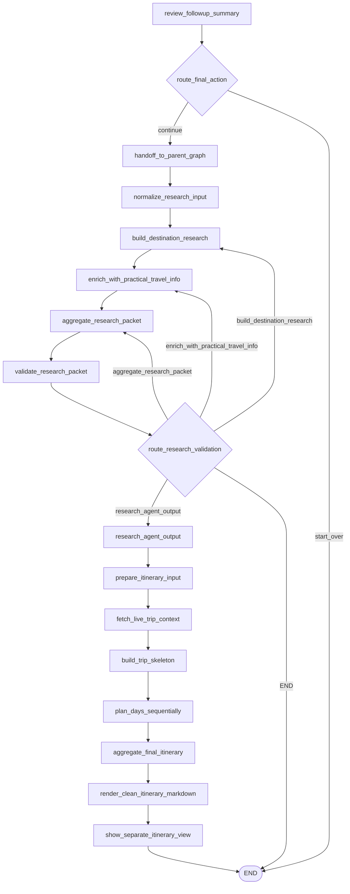

# Travel Research + Itinerary Architecture QA (Codebase-Exact)

Repository root used: `C:\Users\user\Desktop\travel_agent`  
All answers below are derived from current code only.

---

## A. CURRENT GRAPH FLOW AND CONTROL

### 1) Exact graph flow from final follow-up confirmation/continue to final itinerary output
- Exact file path: `C:\Users\user\Desktop\travel_agent\main.py`
- Exact functions:
  - graph construction: `build_graph`
  - routers: `route_final_action`, `route_research_validation` in `C:\Users\user\Desktop\travel_agent\nodes\routing.py`
- Exact current behavior:
  1. `review_followup_summary` sets `final_action` from interrupt payload (`continue`/`start_over`) in `C:\Users\user\Desktop\travel_agent\nodes\review_followup_summary.py::review_followup_summary`
  2. Router `route_final_action`:
     - `continue` -> `handoff_to_parent_graph`
     - `start_over` -> `END`
  3. Continue path:
     - `handoff_to_parent_graph`
     - `normalize_research_input`
     - `build_destination_research`
     - `enrich_with_practical_travel_info`
     - `aggregate_research_packet`
     - `validate_research_packet`
  4. Router `route_research_validation`:
     - `valid=True` -> `research_agent_output`
     - `repair_target=destination_research` -> `build_destination_research`
     - `repair_target=practical_travel_info` -> `enrich_with_practical_travel_info`
     - `repair_target=aggregate` -> `aggregate_research_packet`
     - else -> `END`
  5. Valid path continues:
     - `prepare_itinerary_input`
     - `fetch_live_trip_context`
     - `build_trip_skeleton`
     - `plan_days_sequentially`
     - `aggregate_final_itinerary`
     - `render_clean_itinerary_markdown`
     - `show_separate_itinerary_view`
     - `END`
- Retry loops:
  - research repair loop at `validate_research_packet` + `route_research_validation`
  - retry limit: 1 retry per `repair_target`; second failure clears repair target (`repair_target=None`) causing hard `END`
- END conditions:
  - `final_action=start_over`
  - research invalid with no routeable `repair_target`
  - repair target exceeded retry limit
  - normal terminal `show_separate_itinerary_view -> END`
- What breaks if changed:
  - Renaming node IDs in `main.py` without updating router return strings breaks graph compilation/routing.
  - Removing `validate_research_packet` without changing `route_research_validation` breaks path selection.
- Minimal change needed for safe flow edits:
  - Update node ID strings and conditional mappings together in `build_graph` + router return values.
- Code snippet:
```python
# C:\Users\user\Desktop\travel_agent\main.py::build_graph
graph.add_conditional_edges(
    "review_followup_summary",
    route_final_action,
    {"handoff_to_parent_graph": "handoff_to_parent_graph", END: END},
)
graph.add_conditional_edges(
    "validate_research_packet",
    route_research_validation,
    {
        "build_destination_research": "build_destination_research",
        "enrich_with_practical_travel_info": "enrich_with_practical_travel_info",
        "aggregate_research_packet": "aggregate_research_packet",
        "research_agent_output": "research_agent_output",
        END: END,
    },
)
```

### 2) Files defining this flow
- Graph construction:
  - `C:\Users\user\Desktop\travel_agent\main.py` (`build_graph`)
- Routing:
  - `C:\Users\user\Desktop\travel_agent\nodes\routing.py`
- Handoff:
  - `C:\Users\user\Desktop\travel_agent\nodes\handoff_to_parent_graph.py` (`handoff_to_parent_graph`)
- Research nodes:
  - `C:\Users\user\Desktop\travel_agent\nodes\research_agent.py`
  - `C:\Users\user\Desktop\travel_agent\nodes\research_cache.py`
- Itinerary nodes:
  - `C:\Users\user\Desktop\travel_agent\nodes\itinerary_agent.py`
- Final output nodes:
  - `C:\Users\user\Desktop\travel_agent\nodes\itinerary_agent.py::render_clean_itinerary_markdown`
  - `C:\Users\user\Desktop\travel_agent\nodes\itinerary_agent.py::show_separate_itinerary_view`
  - `C:\Users\user\Desktop\travel_agent\nodes\itinerary_artifacts.py` (artifact fallback when markdown too large)
- What breaks if changed:
  - Any file-level function rename breaks imports in `main.py`.
- Minimal change needed:
  - Keep exported function names stable or update import list in `main.py`.

### 3) Mermaid flow using actual node names
- Exact file path source: `C:\Users\user\Desktop\travel_agent\main.py`
- Code snippet:


### 4) First node after Information Curator complete
- Exact file path: `C:\Users\user\Desktop\travel_agent\main.py`
- Exact node:
  - `handoff_to_parent_graph` sets `information_curator_complete=True`
  - first node *after* completion flag is set: `normalize_research_input`
- Exact required fields before `normalize_research_input` runs:
  - Required hard check: `selected_destination` must be `dict`
  - Read (soft/defaulted): `followup_answers`, `followup_custom_note`, `followup_change_request`, `origin`, `start_date`, `end_date`, `trip_days`, `trip_type`, `budget_mode`, `budget_value`, `member_count`, `has_kids`, `has_seniors`
- What breaks if changed:
  - Missing `selected_destination` throws `ValueError("Selected destination is required before research.")`.
- Minimal change needed:
  - If selected destination can be absent, replace hard check in `normalize_research_input` with fallback destination object.

---

## B. STATE SCHEMA / TRAVELSTATE CONTRACT

### 5) Exact TravelState schema relevant to redesign (grouped)
- Exact file path: `C:\Users\user\Desktop\travel_agent\schemas\travel_state.py`
- Exact class: `TravelState(TypedDict, total=False)`

#### Information Curator outputs
| Field | Type | Writer(s) | Reader(s) |
|---|---|---|---|
| `shortlisted_destinations` | `list[dict[str, Any]]` | `call_destination_research`, `call_destination_research_with_user_hint` | `build_shortlist_cards` |
| `shortlist_cards` | `list[ShortlistCard]` | `build_shortlist_cards` | `await_shortlist_decision`, UI interrupt renderer |
| `explained_shortlisted_destinations` | `list[ShortlistCard]` | `build_shortlist_cards` (compat mirror) | legacy/compat only |
| `selected_destination` | `dict[str, Any]` | `await_shortlist_decision` | `call_generate_contextual_destination_questions`, `normalize_research_input`, UI confirmation |
| `followup_questions` | `list[dict[str, Any]]` | `call_generate_contextual_destination_questions` | `collect_followup_answers` |
| `current_followup_index` | `int` | `call_generate_contextual_destination_questions`, `collect_followup_answers` | `route_followup_progress`, UI |
| `followup_answers` | `list[dict[str, Any]]` | `collect_followup_answers` | `review_followup_summary`, `normalize_research_input` |
| `followup_custom_note` | `str` | `collect_custom_followup_input` | `review_followup_summary`, `normalize_research_input` |
| `followup_change_request` | `str` | `review_followup_summary` | `normalize_research_input` |
| `final_action` | `str` | `review_followup_summary` | `route_final_action`, UI reset logic |
| `information_curator_complete` | `bool` | `handoff_to_parent_graph` | UI completion messaging |

#### Research inputs/outputs
| Field | Type | Writer(s) | Reader(s) |
|---|---|---|---|
| `research_input` | `dict[str, Any]` | `normalize_research_input` | `build_destination_research`, `enrich_with_practical_travel_info`, `prepare_itinerary_input` |
| `destination_research` | `DestinationResearch` | `build_destination_research` | `enrich_with_practical_travel_info`, `aggregate_research_packet` |
| `practical_travel_info` | `PracticalTravelInfo` | `enrich_with_practical_travel_info` | `aggregate_research_packet` |
| `research_packet` | `dict[str, Any]` | `aggregate_research_packet` | `validate_research_packet`, `research_agent_output`, `prepare_itinerary_input`, UI |
| `research_validation` | `dict[str, Any]` | `validate_research_packet` | `route_research_validation`, `research_agent_output`, `prepare_itinerary_input` (via valid check), UI |
| `research_agent_output` | `dict[str, Any]` | `research_agent_output` | downstream graph path only (not UI-rendered explicitly) |
| `citations` | `list[dict[str, Any]]` | `aggregate_research_packet` | `prepare_itinerary_input` fallback source refs |
| `research_warnings` | `list[str]` | `aggregate_research_packet` | `prepare_itinerary_input` |

#### Itinerary inputs/outputs
| Field | Type | Writer(s) | Reader(s) |
|---|---|---|---|
| `itinerary_input` | `ItineraryInput` | `prepare_itinerary_input` | `fetch_live_trip_context`, `build_trip_skeleton`, `plan_days_sequentially`, `aggregate_final_itinerary` |
| `trip_live_context` | `TripLiveContext` | `fetch_live_trip_context` | `build_trip_skeleton`, `plan_days_sequentially`, `aggregate_final_itinerary` |
| `trip_skeleton` | `TripSkeleton` | `build_trip_skeleton` | `plan_days_sequentially`, compat wrappers |
| `day_itinerary_packets` | merged annotated list | `plan_days_sequentially`, compat wrappers | `aggregate_final_itinerary`, UI structured view |
| `final_itinerary` | `FinalItinerary` | `aggregate_final_itinerary` | `render_clean_itinerary_markdown`, UI |
| `itinerary_validation` | `ItineraryValidation` | `aggregate_final_itinerary` | `render_clean_itinerary_markdown`, UI |
| `final_itinerary_markdown` | `str` | `render_clean_itinerary_markdown` | `show_separate_itinerary_view`, UI |
| `final_itinerary_markdown_ref` | `dict[str, str]` | `render_clean_itinerary_markdown` | UI `itinerary_view` artifact read |
| `final_markdown_ref` | `dict[str, str]` | `render_clean_itinerary_markdown` | compat alias |
| `itinerary_view_ready` | `bool` | `show_separate_itinerary_view` | UI view switcher |
| `itinerary_run_id` | `str` | `prepare_itinerary_input` | markdown artifact writer |

#### UI-only (TravelState fields mostly consumed by UI)
| Field | Type | Writer(s) | Reader(s) |
|---|---|---|---|
| `shortlist_cards` | `list[ShortlistCard]` | `build_shortlist_cards` | Streamlit selection card rendering |
| `research_validation` | `dict[str, Any]` | `validate_research_packet` | Streamlit expander |
| `research_packet` | `dict[str, Any]` | `aggregate_research_packet` | Streamlit expander |
| `itinerary_validation` | `dict[str, Any]` | `aggregate_final_itinerary` | Streamlit expander |
| `final_action` | `str` | `review_followup_summary` | Streamlit reset logic |
| `itinerary_view_ready` | `bool` | `show_separate_itinerary_view` | Streamlit mode toggle |
- What breaks if changed:
  - Field renames without node updates cause runtime key-miss behavior.
  - TypedDict itself is non-enforcing runtime, but graph/node code expects specific keys.
- Minimal change needed:
  - Keep old key aliases during migration (pattern already used: `final_brief` alias inside `research_input`).

### 6) Mandatory/optional/inferred fields for research start
- Exact function: `C:\Users\user\Desktop\travel_agent\nodes\research_agent.py::normalize_research_input`
- Mandatory today:
  - `selected_destination` as `dict` (hard `ValueError`)
- Optional (read with defaults):
  - `followup_answers`, `followup_custom_note`, `followup_change_request`
  - trip fields: `origin`, `start_date`, `end_date`, `trip_days`, `trip_type`, `budget_mode`, `budget_value`
  - group fields: `member_count`, `has_kids`, `has_seniors`
- Inferred/auto-generated:
  - `research_input.interests` via `_infer_interests`
  - `research_input.pace` via `_infer_pace`
  - `research_input.constraints` via `_infer_known_constraints`
  - `research_input.curator_summary` via `_build_curator_summary`
- What breaks if changed:
  - Removing selected destination validation allows malformed downstream destination formatting.
- Minimal change needed:
  - If desired, downgrade selected destination check to fallback object and mark validation issue instead of exception.

### 7) Duplicated fields under different names
- Exact file paths/functions:
  - `C:\Users\user\Desktop\travel_agent\nodes\research_agent.py::normalize_research_input`
  - `C:\Users\user\Desktop\travel_agent\nodes\itinerary_agent.py::render_clean_itinerary_markdown`
  - `C:\Users\user\Desktop\travel_agent\nodes\build_shortlist_cards.py::build_shortlist_cards`
- Exact duplicates:
  - `research_input.curator_summary` and `research_input.final_brief` (intentional backward-compatible alias)
  - `final_itinerary_markdown_ref` and `final_markdown_ref` (same artifact ref alias)
  - `shortlist_cards` mirrored to `explained_shortlisted_destinations`
  - `research_packet.citations` duplicated into top-level `state.citations`
- What breaks if changed:
  - Removing aliases can break compat wrappers/readers expecting legacy keys.
- Minimal change needed:
  - Deprecate aliases in 2-step migration: keep writing old key until all readers switched.

### 8) Recommended new TravelState fields for proposed agents
- Based on current patterns in `TravelState` + `research_agent.py`:
- Proposed additions:
  - `destination_knowledge: dict[str, Any]`
  - `travel_essentials: dict[str, Any]`
  - `research_aggregate: dict[str, Any]` (or replace `research_packet`)
  - `research_contract_version: str`
  - `planner_input: dict[str, Any]` (alias/replacement for `itinerary_input`)
  - `planner_warnings: list[str]`
- What breaks if changed:
  - Direct replacement of `research_packet` breaks `validate_research_packet`, `prepare_itinerary_input`, UI expander.
- Minimal change needed:
  - Add new fields first, populate both old+new, then switch readers.

---

## C. CURRENT RESEARCH AGENT CONTRACTS

### 9) Exact input schema to `normalize_research_input()`
- File path/function: `C:\Users\user\Desktop\travel_agent\nodes\research_agent.py::normalize_research_input`
- State fields read:
  - `selected_destination`
  - `followup_answers`, `followup_custom_note`, `followup_change_request`
  - `origin`, `start_date`, `end_date`, `trip_days`, `trip_type`, `budget_mode`, `budget_value`
  - `member_count`, `has_kids`, `has_seniors`
- Helper functions used:
  - `_clean_followup_answers`, `_clean_text`, `_build_curator_summary`
  - `_format_destination`, `_compact_destination`
  - `_safe_int`, `_infer_interests`, `_infer_pace`, `_infer_known_constraints`, `_strip_empty`
- Output schema (`research_input`):
  - `destination: str`
  - `selected_destination: {state_or_region, places_covered, highlights, best_for, duration_fit, why_it_fits}`
  - `trip: {origin,start_date,end_date,trip_days,trip_type,budget_mode,budget_value}`
  - `group_signals: {member_count,has_kids,has_seniors}`
  - `interests: list[str]`
  - `pace: str`
  - `preferences: {followup_answers,custom_note,change_request}`
  - `constraints: list[str]`
  - `curator_summary: str`
  - `final_brief: str` (alias)
- What breaks if changed:
  - Removing `final_brief` alias may break downstream consumers expecting it in prompt payloads/tools.
- Minimal change needed:
  - Keep alias until all consumers reference `curator_summary`.

### 10) Exact schema from `build_destination_research()`
- File path/function:
  - caller: `C:\Users\user\Desktop\travel_agent\nodes\research_agent.py::build_destination_research`
  - normalizer: `_normalize_destination_research`
- Output keys:
  - `destination_summary`, `duration_fit`, `area_clusters`, `must_do_places`, `optional_places`,
    `niche_or_extra_places`, `best_experiences`, `best_food`, `best_activities`,
    `constraints`, `warnings`, `assumptions`, `citations`
- Normalization rules:
  - text trimming via `_trim_text` (`destination_summary` 700, `duration_fit` 450)
  - structured list compaction via `_compact_research_items` (limits vary per field)
  - list trimming via `_trim_str_list`
  - citations cleaned + deduped + capped to 10
  - `_strip_empty(..., keep_empty_keys={"optional_places"})` preserves empty optional bucket key
- Citations behavior:
  - in `_run_research_json`, citations are merged from:
    - tool annotations via `_extract_response_citations(response.content)`
    - model JSON `citations`
    - model JSON `source_refs`
  - dedupe + cap to 20 in `_merge_citations`, then field-level cap 10 in `_normalize_destination_research`
- What breaks if changed:
  - Removing `optional_places` key preservation can fail validation rule `"optional-place distinction is missing."`
- Minimal change needed:
  - If optional bucket removed intentionally, adjust `validate_research_packet` accordingly.

### 11) Exact schema from `enrich_with_practical_travel_info()`
- File path/function:
  - caller: `C:\Users\user\Desktop\travel_agent\nodes\research_agent.py::enrich_with_practical_travel_info`
  - normalizer: `_normalize_practical_travel_info`
- Output keys:
  - `weather_temperature: {summary,facts,warnings}`
  - `carry`
  - `practical_facts`
  - `local_transport`
  - `money`
  - `documents`
  - `safety`
  - `connectivity`
  - `culture`
  - `warnings`
  - `citations`
- Normalization rules:
  - all list fields trimmed to fixed limits
  - `weather_temperature` normalized even if absent via empty dict fallback
  - citations cleaned and capped to 10
- Citations behavior:
  - same `_run_research_json` merge path as destination research
- What breaks if changed:
  - If `practical_notes` cannot be built from these fields, `validate_research_packet` fails practical info check later.
- Minimal change needed:
  - Keep at least fields needed by `_build_practical_notes` (`weather`, `carry`, `practical_facts`, etc.).

### 12) Exact schema from `aggregate_research_packet()`
- File path/function: `C:\Users\user\Desktop\travel_agent\nodes\research_agent.py::aggregate_research_packet`
- Merge behavior:
  - pulls destination fields from `destination_research`
  - practical fields from `practical_travel_info`
  - builds `practical_notes` via `_build_practical_notes(practical)`
  - constraints = destination constraints + first 3 practical facts (deduped)
  - warnings = destination warnings + practical warnings + weather warnings (deduped)
  - citations = merge(destination.citations, practical.citations)
- Output keys in `research_packet`:
  - `destination_summary`, `duration_fit`, `area_clusters`, `must_do_places`, `optional_places`,
    `niche_or_extra_places`, `best_experiences`, `best_food`, `best_activities`,
    `weather_temperature`, `carry`, `practical_facts`, `practical_notes`,
    `constraints`, `warnings`, `assumptions`, `citations`
- Compaction:
  - `_compact_research_packet(packet, RESEARCH_PACKET_CHAR_BUDGET=16000)` applied before state write
- State write:
  - `research_packet`
  - top-level `citations`
  - `research_warnings`
- What breaks if changed:
  - Removing keys checked by validation breaks route to itinerary.
- Minimal change needed:
  - If redesigning packet schema, update `validate_research_packet` + `prepare_itinerary_input` + UI expander assumptions.

### 13) Downstream usage of listed fields
- Code anchors:
  - `C:\Users\user\Desktop\travel_agent\nodes\research_agent.py`
  - `C:\Users\user\Desktop\travel_agent\nodes\itinerary_agent.py`
  - `C:\Users\user\Desktop\travel_agent\UI\app.py`

| Field | Used where | Current behavior | If removed |
|---|---|---|---|
| `destination_summary` | validation, `research_agent_output`, `prepare_itinerary_input -> destination.summary` | required by validation | research validation fails |
| `duration_fit` | validation, `research_agent_output`, `prepare_itinerary_input -> destination.duration_fit` | required by validation | research validation fails |
| `area_clusters` | validation, `prepare_itinerary_input`, `_primary_base_area`, live-context projection | drives base area fallback | validation fails + weaker itinerary clustering |
| `must_do_places` | validation, `prepare_itinerary_input`, `_assign_places_to_slots`, live-context projection | primary candidate pool | validation fails + empty day candidates |
| `optional_places` | validation (key existence), `prepare_itinerary_input`, `_assign_places_to_slots`, projection | secondary pool | validation fails if key absent |
| `niche_or_extra_places` | only `research_packet` storage/compaction | not consumed by itinerary path | safe to remove after schema cleanup |
| `best_experiences` | copied into `itinerary_input` only | currently not consumed in day planner logic | low immediate break; latent contract loss |
| `best_food` | `prepare_itinerary_input`, day planner input `food_ideas`, live projection | influences food ideas | day planner gets less food guidance |
| `best_activities` | copied into `itinerary_input` only | currently not directly consumed | low immediate break |
| `practical_notes` | validation, `prepare_itinerary_input`, `_trip_level_notes`, `_carry_list`, `_documents`, `_do_and_dont` | major source for notes/docs/do-dont | validation fails + weak final markdown sections |
| `constraints` | `prepare_itinerary_input` | stored in itinerary_input, not heavily consumed later | no hard crash, but intent signal lost |
| `warnings` | top-level `research_warnings`, `prepare_itinerary_input`, `_trip_level_notes` | used for important notes | less warnings in final itinerary |
| `assumptions` | copied into `itinerary_input` | not heavily consumed later | low immediate break |
| `citations` | validation, `research_agent_output.citation_count`, `prepare_itinerary_input.source_refs`, UI JSON expander | source notes in final markdown | validation fails (citations required) |

---

## D. VALIDATION / ROUTING / RETRY LOGIC

### 14) Exact current validation logic
- File/function: `C:\Users\user\Desktop\travel_agent\nodes\research_agent.py::validate_research_packet`
- Checks performed:
  - `research_packet` must be dict
  - required non-empty:
    - `destination_summary`
    - `duration_fit`
    - `area_clusters` (non-empty dict list)
    - `must_do_places` (non-empty dict list)
    - `practical_notes` (non-empty dict)
    - `citations` (non-empty)
  - required key presence:
    - `"optional_places" in packet` (can be empty list)
  - packet JSON size <= `RESEARCH_PACKET_CHAR_BUDGET` (16000)
- Retry bookkeeping:
  - increments `repair_attempts[repair_target]`
  - if attempts > 1 for that target, clears `repair_target`

### 15) Validation rules that fail if planning-like fields removed
- Breakpoints:
  - remove `must_do_places` -> fails `if not _clean_dict_list(packet.get("must_do_places") or [])`
  - remove `optional_places` key -> fails `if "optional_places" not in packet`
  - remove `niche_or_extra_places` -> no validation failure
  - remove `best_experiences` -> no validation failure
  - remove `best_food` -> no validation failure
  - remove `best_activities` -> no validation failure
- Minimal change needed:
  - edit `validate_research_packet` required checks to match compact fact-only schema.

### 16) Exact repair/retry routing logic
- Validation producer: `validate_research_packet`
- Router: `C:\Users\user\Desktop\travel_agent\nodes\routing.py::route_research_validation`
- `repair_target` values handled:
  - `"destination_research"` -> node `build_destination_research`
  - `"practical_travel_info"` -> node `enrich_with_practical_travel_info`
  - `"aggregate"` -> node `aggregate_research_packet`
- Retry limit logic:
  - if same target exceeds one retry (`repair_attempts[target] > 1`), target cleared to `None`
- Hard END causes:
  - `repair_target` becomes `None`
  - unknown `repair_target`
  - route returns `END`

### 17) How validation should be rewritten for compact fact suppliers (code-style consistent)
- Exact file to change: `C:\Users\user\Desktop\travel_agent\nodes\research_agent.py::validate_research_packet`
- Current style to preserve:
  - build `issues: list[str]`
  - set `repair_target`
  - cap retries via `repair_attempts`
- Minimal rewrite pattern:
  - remove hard requirements for pre-ranked planning fields (`must_do_places`, optional buckets)
  - require:
    - compact destination summary/context
    - practical essentials summary
    - citations
    - packet size budget
  - keep same `research_validation` structure (`valid`, `issues`, `repair_target`, `repair_attempts`)
- What breaks if not updated:
  - new compact research schema will always fail current validation and never reach itinerary.

---

## E. PROMPTS AND OUTPUT FORMATS

### 18) Every current prompt in research + itinerary layers
- Research layer prompts (file: `C:\Users\user\Desktop\travel_agent\constants\prompts\research_agent_prompts.py`)
  1. `DESTINATION_RESEARCH_SYSTEM_PROMPT` (system) -> used by `build_destination_research` -> expected JSON object
  2. `DESTINATION_RESEARCH_HUMAN_PROMPT` (human) -> used by `build_destination_research` -> expected JSON object
  3. `PRACTICAL_TRAVEL_INFO_SYSTEM_PROMPT` (system) -> used by `enrich_with_practical_travel_info` -> expected JSON object
  4. `PRACTICAL_TRAVEL_INFO_HUMAN_PROMPT` (human) -> used by `enrich_with_practical_travel_info` -> expected JSON object
- Itinerary layer prompts (file: `C:\Users\user\Desktop\travel_agent\constants\prompts\itinerary_agent_prompts.py`)
  5. `LIVE_TRIP_CONTEXT_SYSTEM_PROMPT` (system) -> used by `_run_live_context_llm` -> expected JSON object
  6. `LIVE_TRIP_CONTEXT_HUMAN_PROMPT` (human) -> used by `_run_live_context_llm` -> expected JSON object
  7. `DAY_PLANNING_SYSTEM_PROMPT` (system) -> used by `_run_day_planner_llm` -> expected JSON object
  8. `DAY_PLANNING_HUMAN_PROMPT` (human) -> used by `_run_day_planner_llm` -> expected JSON object
- What breaks if changed:
  - returning non-JSON object/list for these nodes triggers parser/type errors in `_run_research_json` / `_run_itinerary_json`.
- Minimal change needed:
  - if changing output format, update parser gates in both runner functions.

### 19) Exact current prompt contract for itinerary generation
- File paths:
  - prompts: `C:\Users\user\Desktop\travel_agent\constants\prompts\itinerary_agent_prompts.py`
  - node usage: `C:\Users\user\Desktop\travel_agent\nodes\itinerary_agent.py`
- Contracts:
  - Live context prompt requires transport/stay/local fares/meal/attraction/opening/restaurant + refs.
  - Day planning prompt requires one-day JSON with schedule, meals, estimated spend map, note, `source_refs`.
- Citations requested?
  - Yes (`source_ref` / `source_refs` fields in both prompt contracts).
- Cost estimates requested?
  - Yes, explicitly in live context (`cost_label`) and day planning (`estimated_spend` object).
- Transport/how-to-reach included?
  - Yes in live context contract (`origin_destination_transport_context`, `return_transport_context`).
- What breaks if changed:
  - Removing required keys (e.g., schedule/meals/estimated_spend) triggers normalization fallbacks and potential validation issues.
- Minimal change needed:
  - keep keys, shrink semantics first, then update normalizers.

### 20) Where final markdown itinerary structure is defined
- Exact file path/function:
  - `C:\Users\user\Desktop\travel_agent\nodes\itinerary_agent.py::render_clean_itinerary_markdown`
- Current behavior:
  - template-driven by Python list assembly (`lines`), not LLM markdown prompt.
  - helper formatters:
    - `_render_how_to_reach`
    - `_render_return_plan`
    - `_render_stay_plan`
    - `_render_local_transport`
    - `_render_compact_day`
- What breaks if changed:
  - Removing helper sections changes final markdown contract expected by UI/users.
- Minimal change needed:
  - adjust formatter functions; no prompt changes required for markdown layout.

### 21) Prompt instructions to remove if itinerary planner is sole decider
- File to edit:
  - `C:\Users\user\Desktop\travel_agent\constants\prompts\research_agent_prompts.py`
- Current research prompt keys to remove/reduce:
  - from `DESTINATION_RESEARCH_HUMAN_PROMPT`:
    - `must_do_places`
    - `optional_places`
    - `niche_or_extra_places`
    - `best_experiences`
    - `best_food`
    - `best_activities`
- Why:
  - these are planning-like/pre-ranking outputs currently consumed by itinerary planner logic.
- What breaks if removed without code changes:
  - validation + itinerary input builder assumptions fail (`validate_research_packet`, `_assign_places_to_slots`, live projection).
- Minimal change needed:
  - remove these outputs from prompts only after updating validation and itinerary input/assignment logic.

---

## F. MODEL / TOOL / RESEARCH SETTINGS

### 22) Exact model config in research layer
- File paths/functions:
  - base model getter: `C:\Users\user\Desktop\travel_agent\llm.py::get_research_llm`
  - node binding: `C:\Users\user\Desktop\travel_agent\nodes\research_agent.py::_run_research_json`
- Current config:
  - model name: `resolve_research_model_name()` -> env `OPENAI_RESEARCH_MODEL` default `"gpt-5"`; coerces mini -> `"gpt-5"`
  - ChatOpenAI flags: `use_responses_api=True`, `output_version="responses/v1"`
  - tool binding:
    - tools: `RESEARCH_TOOLS=[{"type":"web_search"}]`
    - `tool_choice="auto"`
    - reasoning: `RESEARCH_REASONING={"effort":"medium"}`
  - no explicit temperature/max tokens/json mode flag
- Code snippet:
```python
model = get_research_llm().bind_tools(
    RESEARCH_TOOLS,
    tool_choice="auto",
    reasoning=RESEARCH_REASONING,
)
```

### 23) Does itinerary layer use same config?
- File paths/functions:
  - getter: `C:\Users\user\Desktop\travel_agent\llm.py::get_itinerary_llm`
  - runner: `C:\Users\user\Desktop\travel_agent\nodes\itinerary_agent.py::_run_itinerary_json`
- Difference:
  - model default: `OPENAI_ITINERARY_MODEL` default `"gpt-5.4"`; mini coerced to `"gpt-5.4"`
  - responses API enabled similarly
  - web search usage differs by call:
    - live context: `use_web_search=True`, `tool_choice="web_search"`, reasoning medium
    - day planning: `use_web_search=False`, no tools, only `model.bind(reasoning={"effort":"medium"})`
- So: not same effective tool configuration.

### 24) Where to change for all listed nodes to always use GPT-5 + reasoning high + web_search
- Required code points:
  1. `C:\Users\user\Desktop\travel_agent\llm.py`
     - force `resolve_research_model_name` and `resolve_itinerary_model_name` to return `"gpt-5"`
  2. `C:\Users\user\Desktop\travel_agent\nodes\research_agent.py`
     - set `RESEARCH_REASONING={"effort":"high"}`
     - keep tools list and optionally force `tool_choice="web_search"`
  3. `C:\Users\user\Desktop\travel_agent\nodes\itinerary_agent.py`
     - in `_run_day_planner_llm`, set `use_web_search=True`
     - or in `_run_itinerary_json`, ignore `use_web_search` and always bind web search + high reasoning
- What breaks if done blindly:
  - cost/latency increases; deterministic behavior changes.
- Minimal change needed:
  - centralize settings constants and use them in both `_run_research_json` and `_run_itinerary_json`.

### 25) Hidden defaults/wrappers that affect prompt expectations
- Exact code anchors:
  - `llm.py` getters
  - parser gates in `services/llm_response_parsing.py`
  - node runners `_run_research_json`, `_run_itinerary_json`
- Current hidden/default behavior:
  - No explicit temperature set (SDK default applies).
  - No explicit max token cap in code.
  - Research and itinerary runners require top-level JSON object (`dict`) and raise otherwise.
  - Day planner currently has web search disabled at runtime (`use_web_search=False`).
  - Parser accepts fenced JSON and Python-literal fallback via `ast.literal_eval`.
- What breaks if changed:
  - Changing parser strictness can reject currently tolerated outputs.
- Minimal change needed:
  - If stricter JSON required, remove `ast.literal_eval` fallback and update prompts/test fixtures.

---

## G. PARSING / JSON / CITATIONS

### 26) Exact parser used for research outputs
- File path/functions:
  - `C:\Users\user\Desktop\travel_agent\services\llm_response_parsing.py`
    - `extract_text_content`
    - `clean_json_text`
    - `load_json_payload`
  - Invoked from `C:\Users\user\Desktop\travel_agent\nodes\research_agent.py::_run_research_json`
- Conversion flow:
  1. `response.content` -> `extract_text_content(...)` (handles str/list/dict text blocks)
  2. text -> `load_json_payload(...)`
  3. `load_json_payload`:
     - strip markdown fences via `clean_json_text`
     - try `json.loads`
     - fallback `ast.literal_eval`
- Malformed JSON handling:
  - no custom repair; if both parses fail, exception propagates.

### 27) Exact parser for itinerary output
- JSON itinerary LLM outputs:
  - same parser path as research in `_run_itinerary_json` (`extract_text_content` + `load_json_payload`)
  - top-level must be dict
- Markdown itinerary output:
  - not parsed from model
  - generated directly by Python in `render_clean_itinerary_markdown`
  - then optionally persisted via artifact ref

### 28) Citation extraction today
- Research path:
  - `C:\Users\user\Desktop\travel_agent\nodes\research_agent.py::_run_research_json`
  - merges:
    - tool annotation URLs from `_extract_response_citations(response.content)`
    - payload `citations`
    - payload `source_refs`
  - dedupe/limit:
    - `_merge_citations` dedupes by URL and caps at 20
    - field normalizers cap to 10
    - packet compaction may reduce to 8/5/3 depending on size pass
- Itinerary path:
  - `_run_itinerary_json` merges tool annotation citations + payload `source_refs`
  - `_compact_citations` dedupes by URL and normalizes `ref_type`
  - later slices:
    - source refs in live context collect: `[:12]`
    - day refs: `[:6]`
    - final source notes: `[:10]`
    - markdown output prints first 8 source notes

### 29) Safest compact JSON response shape for two new research agents
- Based on current parser and normalizer style:
  - top-level must be one JSON object
  - include `citations` as list of `{title,url}`
- Safe shape recommendation:
```json
{
  "summary": "short text",
  "facts": ["fact 1", "fact 2"],
  "structured": {"key": "value"},
  "warnings": ["warning"],
  "assumptions": ["assumption"],
  "citations": [{"title": "Source", "url": "https://..."}]
}
```
- What breaks if changed:
  - top-level arrays break `_run_research_json` dict guard.

### 30) Parser capability matrix (from code)
- One JSON object only:
  - `load_json_payload` can parse more than object, but research/itinerary runner requires dict -> non-dict rejected.
- Nested objects:
  - supported.
- Optional missing keys:
  - supported; code uses `.get(...)` with cleaners/fallbacks.
- Markdown-wrapped JSON:
  - supported by `clean_json_text`.
- Arrays at top-level:
  - supported by parser but rejected in research/itinerary runners (accepted in contextual question node which expects list).

---

## H. CACHE / SIZE / COMPACTION

### 31) Exact caching behavior for research nodes
- File paths:
  - cache util: `C:\Users\user\Desktop\travel_agent\nodes\research_cache.py`
  - caller: `C:\Users\user\Desktop\travel_agent\nodes\research_agent.py::_run_research_json`
- Node names using cache calls:
  - `build_destination_research` (`node_type="destination_research"`)
  - `enrich_with_practical_travel_info` (`node_type="practical_travel_info"`)
- Cache key composition:
  - `make_cache_key(node_type, payload)` -> SHA256 over canonical JSON payload
- TTL:
  - TTL map in `CACHE_TTLS_SECONDS` has keys like `"coverage"`, `"weather"`, etc.
  - **No TTL entries for** `"destination_research"` or `"practical_travel_info"`
  - result: caching effectively disabled for current research nodes
- Payload stored:
  - if TTL key exists, stored object: `{node_type, created_at, payload}`
  - payload includes citations merged in `_run_research_json`
- What breaks if changed:
  - adding TTL for active node types changes runtime determinism/staleness profile.
- Minimal change needed:
  - add keys `"destination_research"` and `"practical_travel_info"` to `CACHE_TTLS_SECONDS`.

### 32) Is itinerary generation cached?
- Exact files:
  - `C:\Users\user\Desktop\travel_agent\nodes\itinerary_agent.py`
  - `C:\Users\user\Desktop\travel_agent\nodes\itinerary_artifacts.py`
- Current behavior:
  - no response cache for itinerary LLM calls.
  - only artifact write/read for large markdown output (`final_itinerary_markdown_ref`).
- So: itinerary generation is not cached.

### 33) Exact size-control / compaction logic
- Research packet budget:
  - constant `RESEARCH_PACKET_CHAR_BUDGET = 16000` in `research_agent.py`
  - enforced by `_compact_research_packet` called in `aggregate_research_packet`
- Compaction passes:
  - progressive passes `(item_limit, text_limit, citation_limit)`:
    - `(5,180,8)`, `(4,130,5)`, `(3,90,3)`
  - trims field lists and nested objects first; citations aggressively reduced by pass
- What itinerary sees:
  - `prepare_itinerary_input` reads compacted `state["research_packet"]`, so itinerary consumes post-compaction values.
- Additional budgets:
  - `PROJECTION_CHAR_BUDGET = 12000` for live/day planner inputs (`assert_projection_budget`)
  - `MARKDOWN_STATE_CHAR_BUDGET = 16000` for markdown in state before artifact fallback

### 34) Can compaction be simplified for two compact fact agents?
- Yes, mostly.
- Why from current paths:
  - current compaction complexity exists because packet carries many planning-heavy lists.
  - with compact fact schemas, fewer fields need aggressive multi-pass trimming.
- Minimal change:
  - keep one size guard + shallow trimming.
  - remove heavy `_compact_research_items` usage if planning lists are removed.
- What breaks if removed blindly:
  - `validate_research_packet` size check and downstream expectations still assume current packet keys.

---

## I. ITINERARY INPUT BUILDER

### 35) Node equivalent to `prepare_itinerary_input`
- Exact file path/function:
  - `C:\Users\user\Desktop\travel_agent\nodes\itinerary_agent.py::prepare_itinerary_input`
- Inputs read:
  - `research_validation`
  - `research_packet`
  - `research_input`
  - `selected_destination`
  - top-level `citations`, `research_warnings`, trip/group fallback fields
- Output schema:
  - `itinerary_input` object with:
    - `trip_summary`, `destination`, `traveler_group`, `preferences`
    - `area_clusters`, `must_do_places`, `optional_places`
    - `best_food`, `best_experiences`, `best_activities`
    - `practical_notes`, `constraints`, `assumptions`, `warnings`, `source_refs`
  - `itinerary_run_id`
- What breaks if changed:
  - downstream live/day planner assumes these keys.
- Minimal change:
  - maintain key compatibility while introducing new planner input shape.

### 36) Exact research data passed into itinerary today
- Transfer point:
  - `prepare_itinerary_input` (research -> itinerary)
- Final payload to itinerary LLMs:
  - Live context LLM receives projection from `_build_live_context_projection(itinerary_input)` with:
    - destination/trip/traveler_group/logistics_needed/must_do_places/optional_places/best_food/area_clusters/practical_notes subset
  - Day planner LLM receives `day_input` from `plan_days_sequentially`:
    - `slot`, `destination`, `traveler_group`, `preferences`, `candidates`, `food_ideas`,
      `live_context`, `logistics`, `already_planned_places`, `rules`

### 37) Where itinerary input assumes pre-ranked research outputs
- Exact functions:
  - `_assign_places_to_slots` uses `must_do_places` first, then `optional_places`
  - `_build_live_context_projection` includes must/optional names to fetch targeted cost/timing context
  - `plan_days_sequentially` feeds assigned candidates into day planner
- Assumptions present:
  - must-do bucket exists and is high priority
  - optional bucket exists as fallback
  - precomputed best_* lists available
- What breaks if removed:
  - day candidate assignment becomes sparse/empty.
- Minimal change:
  - replace `_assign_places_to_slots` input source with new compact knowledge facts.

### 38) Exact changes needed if research becomes only knowledge + essentials
- Required code changes:
  1. `prepare_itinerary_input`:
     - stop expecting `must_do_places` / `optional_places` / `best_*`
     - derive candidate pools from knowledge facts/areas
  2. `_assign_places_to_slots`:
     - accept a generic `candidate_places` list with planner-side ranking
  3. `_build_live_context_projection`:
     - remove hard dependency on must/optional lists
  4. `validate_research_packet`:
     - remove checks for planning buckets
- Minimal migration-safe step:
  - add derived `candidate_places` while still populating old keys until planner fully switched.

---

## J. UI / STREAMLIT DEPENDENCIES

### 39) UI places that show research-related outputs
- Exact file path: `C:\Users\user\Desktop\travel_agent\UI\app.py::_render_graph_completion`
- Reads:
  - `research_packet` (shown via `st.json`)
  - `research_validation` (shown via expander)
  - `itinerary_validation` (shown if present)
- Not directly read in UI:
  - `research_agent_output`
  - top-level `citations`
  - `must_do_count`, `optional_count`, `practical_topics` from `research_agent_output`
  - `research_warnings` (only consumed by itinerary prep, not directly rendered)

### 40) UI breakpoints if planning-like research fields removed
- UI direct break risk:
  - low; UI dumps `research_packet` JSON generically.
- Actual break risk:
  - itinerary nodes may fail before UI reaches final view; UI then only shows warnings/errors.
- Exact components impacted indirectly:
  - `UI/app.py::_render_graph_completion` messages based on validation state.
- Minimal UI change needed:
  - none required if validation + itinerary pipeline are updated coherently.

### 41) Markdown expectations across stages
- Exact behavior:
  - Final itinerary markdown: yes (`render_clean_itinerary_markdown` -> `UI/itinerary_view.py`)
  - Research stage: JSON/state, not markdown document
  - Final follow-up confirmation: Streamlit container UI, not markdown doc generation
  - Chat UI uses markdown rendering for message text formatting only (`render_chat`)

---

## K. MINIMUM REFACTOR MAP

### 42) Minimum file set to change for new redesign
- Prompts:
  - `C:\Users\user\Desktop\travel_agent\constants\prompts\research_agent_prompts.py`
  - `C:\Users\user\Desktop\travel_agent\constants\prompts\itinerary_agent_prompts.py`
- Research nodes:
  - `C:\Users\user\Desktop\travel_agent\nodes\research_agent.py`
- Itinerary nodes:
  - `C:\Users\user\Desktop\travel_agent\nodes\itinerary_agent.py`
- Routing/graph:
  - `C:\Users\user\Desktop\travel_agent\main.py` (if node names split/added)
  - `C:\Users\user\Desktop\travel_agent\nodes\routing.py` (if retry targets renamed)
- State schema:
  - `C:\Users\user\Desktop\travel_agent\schemas\travel_state.py`
- Parser:
  - `C:\Users\user\Desktop\travel_agent\services\llm_response_parsing.py` (only if stricter contract needed)
- Model config:
  - `C:\Users\user\Desktop\travel_agent\llm.py`
  - possibly in-node binding sites in `research_agent.py` and `itinerary_agent.py`
- UI:
  - `C:\Users\user\Desktop\travel_agent\UI\app.py` (if research preview fields change materially)
- Cache:
  - `C:\Users\user\Desktop\travel_agent\nodes\research_cache.py` (if enabling/retuning cache)
- Tests:
  - `C:\Users\user\Desktop\travel_agent\tests\*` (new schema and flow tests)

### 43) Required vs recommended vs optional per file
- Required:
  - `nodes/research_agent.py`
  - `nodes/itinerary_agent.py`
  - `constants/prompts/research_agent_prompts.py`
  - `schemas/travel_state.py`
  - tests covering new contracts
- Recommended:
  - `constants/prompts/itinerary_agent_prompts.py`
  - `main.py` (if introducing separate named nodes: destination_knowledge_agent, travel_essentials_agent, aggregator)
  - `nodes/routing.py` (if repair target names change)
  - `UI/app.py` (better research preview)
  - `nodes/research_cache.py` (if cache policy should align with new node names)
- Optional:
  - `services/llm_response_parsing.py` (only if parser strictness/schema mode changes)
  - `llm.py` (if model/tool config unchanged)

### 44) Existing code keepable almost as-is
- Keepable helpers:
  - JSON parsing: `services/llm_response_parsing.py`
  - citation extraction/merge: `research_agent.py::_extract_response_citations`, `_merge_citations`, `_clean_citations`
  - general cleaners: `_clean_text`, `_clean_str_list`, `_strip_empty`, `_safe_int` in research/itinerary nodes
  - artifact handling: `nodes/itinerary_artifacts.py`
  - cache utility structure: `nodes/research_cache.py` (logic is reusable; TTL mapping needs alignment)
- Partially keepable:
  - `normalize_research_input` (good pattern; adjust output schema fields)

### 45) Code to delete or heavily rewrite for new architecture
- Heavy rewrite:
  - `research_agent.py::_normalize_destination_research` (planning-heavy output contract)
  - `research_agent.py::validate_research_packet` (hard checks for must/optional planning buckets)
  - `itinerary_agent.py::_assign_places_to_slots` (depends on must/optional pre-ranking)
  - `itinerary_agent.py::_build_live_context_projection` (currently emits must/optional place names)
  - `itinerary_agent.py::prepare_itinerary_input` (expects planning-shaped research packet)
- Likely remove/replace:
  - planning-heavy prompt fields in `research_agent_prompts.py`.

---

## L. NEW ARCHITECTURE FEASIBILITY

### 46) Feasibility assessment
- Verdict: **mostly yes**
- Why:
  - architecture already split into independent nodes with explicit contracts and routing.
  - parser, citation, compaction, and validation are centralized and modifiable.
- Top 5 blockers in current code:
  1. `validate_research_packet` requires planning buckets (`must_do_places`, `optional_places` key).
  2. `prepare_itinerary_input` strongly maps those planning fields into itinerary input.
  3. `_assign_places_to_slots` assumes pre-ranked must/optional lists.
  4. `research_cache` TTL mapping does not match active research node names.
  5. `TravelState` still contains legacy aliases (`final_brief`, `explained_shortlisted_destinations`) creating migration ambiguity.

### 47) Proposed clean schema: Destination Knowledge Agent
- Based on current parser/style (single JSON object + citations):
```json
{
  "destination_summary": "short factual summary",
  "seasonality": {
    "best_window": "string",
    "weather_pattern": ["string"]
  },
  "areas": [
    {
      "name": "area/cluster",
      "places": ["place 1", "place 2"],
      "access_notes": ["short note"]
    }
  ],
  "notable_experiences": ["string"],
  "known_constraints": ["string"],
  "warnings": ["string"],
  "assumptions": ["string"],
  "citations": [{"title": "Source", "url": "https://..."}]
}
```

### 48) Proposed clean schema: Travel Essentials Agent
```json
{
  "transport_basics": {
    "arrival": {"mode_options": ["flight", "train"], "time_range": "string", "cost_range": "string"},
    "return": {"mode_options": ["flight", "train"], "time_range": "string", "cost_range": "string"}
  },
  "stay_basics": {
    "recommended_base_areas": ["string"],
    "nightly_budget_range": "string"
  },
  "local_mobility": [
    {"scope": "short ride", "cost_range": "string", "note": "string"}
  ],
  "money": ["string"],
  "documents": ["string"],
  "safety": ["string"],
  "connectivity": ["string"],
  "culture": ["string"],
  "packing": ["string"],
  "warnings": ["string"],
  "citations": [{"title": "Source", "url": "https://..."}]
}
```

### 49) Proposed aggregated research schema for itinerary planner handoff
```json
{
  "destination_context": {
    "summary": "string",
    "areas": [{"name": "string", "places": ["string"]}],
    "constraints": ["string"],
    "warnings": ["string"]
  },
  "essentials_context": {
    "arrival_transport": {"time_range": "string", "cost_range": "string"},
    "return_transport": {"time_range": "string", "cost_range": "string"},
    "stay_basics": {"base_areas": ["string"], "nightly_budget_range": "string"},
    "local_mobility": [{"scope": "string", "cost_range": "string"}],
    "money": ["string"],
    "documents": ["string"],
    "safety": ["string"],
    "packing": ["string"]
  },
  "traveler_preferences": {
    "pace": "string",
    "interests": ["string"],
    "followup_answers": [{"question": "string", "answer": "string|list"}],
    "custom_note": "string",
    "change_request": "string"
  },
  "citations": [{"title": "Source", "url": "https://..."}]
}
```

### 50) Clean itinerary output contract (markdown final answer)
- Existing markdown section order from `render_clean_itinerary_markdown` is clean and reusable:
  1. `# Final Itinerary`
  2. `## Trip Summary`
  3. `## How To Reach`
  4. `## Return Plan`
  5. `## Stay Plan`
  6. `## Local Transport`
  7. `## Day-By-Day Itinerary`
  8. `## Cost Summary`
  9. `## Carry List`
  10. `## Important Notes` (optional)
  11. `## Documents` (optional)
  12. `## Do And Don't` (optional)
  13. `## Source Notes` (optional)
- Data ownership split:
  - From research: destination facts, essentials, constraints, citations
  - Synthesized by itinerary planner: day sequencing, place selection, pacing, exact day schedule, per-day spend composition

---

## M. IMPLEMENTATION ORDER

### 51) Safe phased implementation order
- Phase 1: Contract scaffolding
  - Files: `schemas/travel_state.py`, `nodes/research_agent.py` (add new fields + dual-write aliases)
  - Test: state schema + normalize input tests
- Phase 2: Research split
  - Files: `constants/prompts/research_agent_prompts.py`, `nodes/research_agent.py`
  - Change: split destination knowledge + essentials + aggregator outputs
  - Test: parser robustness, citations merge, validation route behavior
- Phase 3: Validation/routing alignment
  - Files: `nodes/research_agent.py::validate_research_packet`, `nodes/routing.py`, maybe `main.py`
  - Test: repair targets + retry limits + END behavior
- Phase 4: Itinerary input migration
  - Files: `nodes/itinerary_agent.py`
  - Change: remove pre-ranked bucket dependency, derive planner candidates internally
  - Test: day planning + final itinerary validation + markdown render
- Phase 5: UI and docs cleanup
  - Files: `UI/app.py`, docs markdown files
  - Test: manual UI flow for research preview and final itinerary view
- Phase 6: cache/model tuning
  - Files: `nodes/research_cache.py`, `llm.py`, node bind settings
  - Test: deterministic cache behavior and model config sanity

### 52) Smallest first refactor proving architecture
- Minimal proof change:
  - relax `validate_research_packet` to stop requiring `must_do_places` and `optional_places` key
  - update `prepare_itinerary_input` to tolerate missing must/optional by deriving empty-safe candidates
- Files:
  - `nodes/research_agent.py`
  - `nodes/itinerary_agent.py`
- Why this proves approach:
  - demonstrates planner can run with compact research facts without immediate full prompt redesign.

### 53) Tests/manual checks after refactor
- Graph flow:
  - continue path reaches itinerary end
  - retry loops still terminate safely
- State correctness:
  - `research_input` contains expected new fields
  - old alias fields still present during migration if needed
- Parser correctness:
  - fenced JSON, nested JSON, missing optional keys
- Citation correctness:
  - tool annotation + payload citation merge + dedupe + limits
- UI correctness:
  - research preview still renders
  - itinerary view still reads markdown/ref artifact
- Itinerary output correctness:
  - markdown section order intact
  - day count equals trip_days
  - spend labels not missing/not “Not priced”

### 54) Hidden coupling areas right now
- research output shape <-> validation:
  - `validate_research_packet` enforces planning-shaped packet.
- validation <-> routing:
  - `repair_target` strings must match `route_research_validation` branches.
- research output <-> itinerary input:
  - `prepare_itinerary_input` maps specific keys like `must_do_places`, `best_food`, `practical_notes`.
- itinerary input <-> planner behavior:
  - `_assign_places_to_slots` depends on must/optional.
- research packet <-> UI preview:
  - UI shows raw `research_packet`; shape changes alter visible payload.
- node_type names <-> cache TTL:
  - cache currently mismatched due missing TTL keys for active node types.

### 55) Single consolidated answer in requested format

#### 1. Current architecture summary
- Information curator ends at `review_followup_summary` with `final_action`.
- Continue route: handoff -> normalized research -> destination research -> practical research -> aggregate -> validate/repair loop -> research output -> itinerary input -> live context -> skeleton -> day planning -> aggregate final itinerary -> markdown render -> itinerary view ready.

#### 2. Breakpoints for redesign
- Hard blockers:
  - validation requires `must_do_places` + `optional_places` key.
  - itinerary planner assignment logic consumes must/optional buckets.
  - prompt contracts currently ask research to pre-rank planning artifacts.

#### 3. Required code changes
- Required:
  - `nodes/research_agent.py` (schemas + validation + aggregation)
  - `nodes/itinerary_agent.py` (input mapping + candidate assignment)
  - `constants/prompts/research_agent_prompts.py`
  - `schemas/travel_state.py`
- Recommended:
  - `main.py`, `nodes/routing.py`, `UI/app.py`, tests.

#### 4. Safest new schemas
- Use top-level JSON object contracts with explicit `citations:[{title,url}]`.
- Keep aggregated handoff concise and fact-oriented.
- Let itinerary planner synthesize selection/priority/day structure.

#### 5. Implementation order
- 1) dual-write fields + tolerant validation
- 2) split research agent outputs
- 3) migrate itinerary input/assignment
- 4) remove legacy planning fields from research prompts
- 5) clean aliases + UI/docs + cache alignment

#### 6. Risks and edge cases
- If validation updated before itinerary tolerance, graph may pass invalid planner inputs.
- If prompts changed before parser/normalizer, type failures occur.
- If aliases removed too early (`final_brief`, old packet keys), downstream compat breaks.
- Cache TTL mismatch may hide intended caching behavior.

#### 7. Recommended next step
- Implement smallest proof refactor first:
  - make planner tolerant to missing must/optional buckets
  - relax validation requirements for those buckets
  - keep current prompts temporarily
  - run full graph + tests before deeper schema split.

