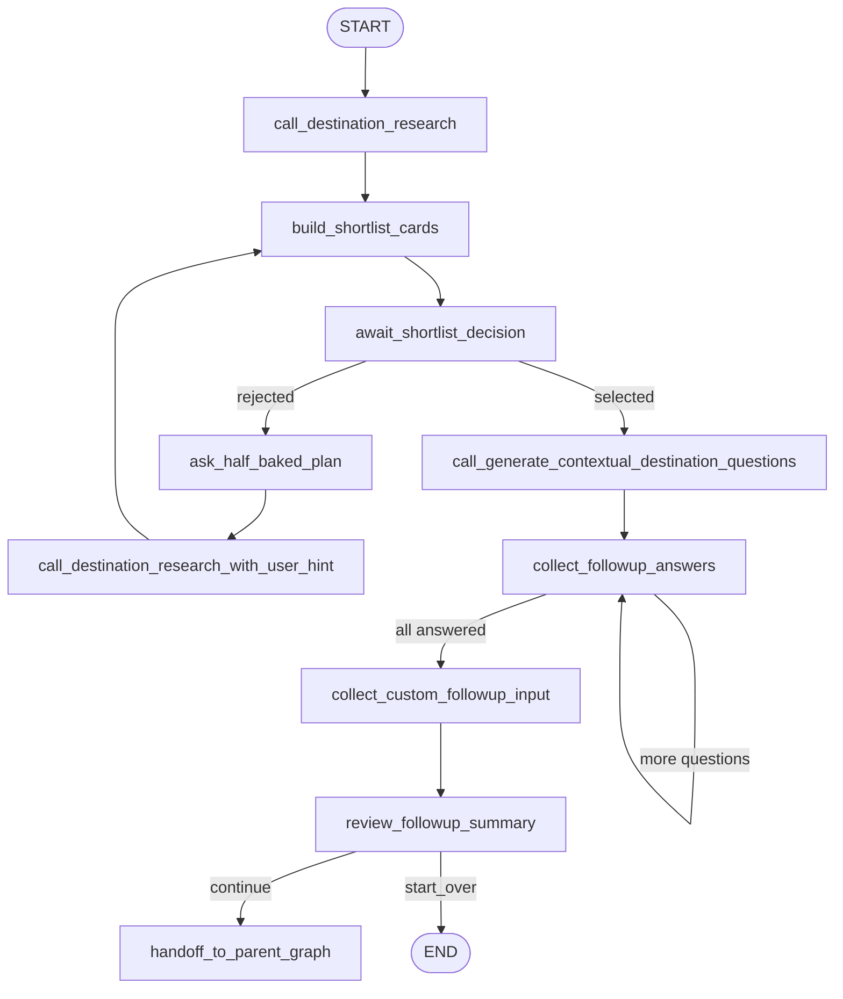

# Information Curator Agent (Detailed Guide)

## What This Agent Does

The Information Curator Agent is the **first major workflow** in your LangGraph pipeline.

Its job is:

1. Take user trip basics.
2. Generate and explain 4 destination shortlist options.
3. Let user select or reject shortlist.
4. Ask destination-specific follow-up questions.
5. Build a final read-only trip brief.
6. Ask user whether to continue to research/itinerary or start over.

It is a guided intent-refinement layer before factual research and full itinerary generation.

## Where The Code Lives

### Graph wiring (nodes + edges)

- `main.py`
  - `build_graph()`
  - All node registration and edge connections are defined here.

### Routing logic (conditional edges)

- `nodes/routing.py`
  - `route_shortlist_decision()`
  - `route_followup_progress()`
  - `route_final_action()`

### Agent nodes (Information Curator only)

- `nodes/call_destination_research.py`
- `nodes/build_shortlist_cards.py`
- `nodes/await_shortlist_decision.py`
- `nodes/ask_half_baked_plan.py`
- `nodes/call_destination_research_with_user_hint.py`
- `nodes/call_generate_contextual_destination_questions.py`
- `nodes/collect_followup_answers.py`
- `nodes/collect_custom_followup_input.py`
- `nodes/review_followup_summary.py`
- `nodes/handoff_to_parent_graph.py`

### Prompt contracts used by this agent

- `constants/prompts/information_curator_prompts.py`

### Shared state contract

- `schemas/travel_state.py`
  - `TravelState` fields used by this agent are listed below.

### UI interrupt rendering (how user interacts with pauses)

- `UI/app.py`
  - `_render_graph_interrupt()`
- `UI/components.py`
  - `render_shortlist_decision()`
  - `render_half_baked_plan_input()`
  - `render_followup_question()`
  - `render_custom_followup_input()`
  - `render_followup_summary_review()`

## Information Curator State Fields

These are the key `TravelState` keys used by this agent:

- Basic trip input keys:
  - `origin`, `start_date`, `end_date`, `trip_days`
  - `trip_type`, `member_count`, `has_kids`, `has_seniors`
  - `budget_mode`, `budget_value`
- Shortlist and selection:
  - `shortlisted_destinations`
  - `explained_shortlisted_destinations`
  - `shortlist_cards`
  - `shortlist_decision`
  - `selected_destination`
  - `user_hint`
- Follow-up flow:
  - `followup_questions`
  - `current_followup_index`
  - `followup_answers`
  - `followup_custom_note`
  - `followup_change_request`
- Final confirmation and handoff control:
  - `final_action`
  - `information_curator_complete`

## Step-by-Step Node Behavior

### 1) `call_destination_research`

- Builds `travel_input` from trip basics.
- Calls LLM with shortlist prompt.
- Enforces exactly 4 JSON destination groups.
- Writes `shortlisted_destinations`.

### 2) `build_shortlist_cards`

- Deterministically cleans and normalizes `shortlisted_destinations`.
- Preserves card contract fields and adds `card_title`, `trip_feel`, `pace`.
- Writes top 4 cleaned cards to `shortlist_cards`.
- Mirrors cards into `explained_shortlisted_destinations` for backward compatibility.

### 3) `await_shortlist_decision` (interrupt node)

- Pauses graph with interrupt payload type `shortlist_decision`.
- User can:
  - select one card -> `shortlist_decision = "selected"` and set `selected_destination`
  - reject shortlist -> `shortlist_decision = "rejected"`

### 4A) If rejected: `ask_half_baked_plan` -> `call_destination_research_with_user_hint`

- `ask_half_baked_plan` pauses for rough preference text.
- Saves to `user_hint`.
- Re-runs shortlist generation with hint.
- Loops back to card normalization + selection.

### 4B) If selected: generate and collect follow-ups

- `call_generate_contextual_destination_questions`
  - Generates exactly 4 destination-specific MCQ questions.
  - Writes `followup_questions`, resets answer progress.
- `collect_followup_answers`
  - Interrupts for one question at a time.
  - Appends each answer to `followup_answers`.
  - Increments `current_followup_index`.
  - Loops until all answered.

### 5) `collect_custom_followup_input`

- Interrupt for free-text additional notes.
- Writes `followup_custom_note`.

### 6) `review_followup_summary`

- Builds a structured Streamlit confirmation payload with:
  - selected destination context
  - selected answers
  - extra preference
  - optional final correction text
- Interrupt captures final action:
  - `continue`
  - `start_over`
- Stores final correction in `followup_change_request`.
- Writes `final_action`.

### 7) `handoff_to_parent_graph`

- When user chooses `continue`, sets:
  - `information_curator_complete = True`
- Then graph proceeds into research flow.

## Exact Edge Connectivity (Information Curator Scope)

Defined in `main.py`:

- `START -> call_destination_research`
- `call_destination_research -> build_shortlist_cards`
- `build_shortlist_cards -> await_shortlist_decision`

Conditional (`route_shortlist_decision`):

- `await_shortlist_decision -> call_generate_contextual_destination_questions` when selected
- `await_shortlist_decision -> ask_half_baked_plan` when rejected

Rejected loop:

- `ask_half_baked_plan -> call_destination_research_with_user_hint`
- `call_destination_research_with_user_hint -> build_shortlist_cards`

Selected follow-up path:

- `call_generate_contextual_destination_questions -> collect_followup_answers`

Conditional follow-up loop (`route_followup_progress`):

- `collect_followup_answers -> collect_followup_answers` while pending questions remain
- `collect_followup_answers -> collect_custom_followup_input` when done

Final confirmation and action:

- `collect_custom_followup_input -> review_followup_summary`

Conditional final action (`route_final_action`):

- `review_followup_summary -> handoff_to_parent_graph` when action is `continue`
- `review_followup_summary -> END` when action is `start_over`

## Mermaid Diagram

## Interrupts (Where UI Waits For User)

These nodes call `interrupt(...)`:

- `await_shortlist_decision`
- `ask_half_baked_plan`
- `collect_followup_answers`
- `collect_custom_followup_input`
- `review_followup_summary`

How to trace:

1. Node emits payload with a `type`.
2. `UI/app.py` `_render_graph_interrupt()` switches by `type`.
3. `UI/components.py` renders widget and returns resume payload.
4. Graph resumes with `Command(resume=payload)`.

## Prompt-Level Notes

From `information_curator_prompts.py`:

- Shortlist prompt forces exactly 4 destination groups.
- Explanation prompt keeps card output short and JSON-only.
- Follow-up prompt returns 4-6 destination-aware questions with mixed input types.

This is why the agent stays in "curation mode" and does not overstep into final itinerary planning.

## How To Read This Agent Code (Recommended Order)

Read in this exact order for clarity:

1. `main.py`:
   - Identify all Information Curator nodes and edges first.
2. `nodes/routing.py`:
   - Understand all branch decisions.
3. Interrupt nodes:
   - `await_shortlist_decision.py`
   - `ask_half_baked_plan.py`
   - `collect_followup_answers.py`
   - `collect_custom_followup_input.py`
   - `review_followup_summary.py`
4. LLM generation nodes:
   - `call_destination_research.py`
   - `call_destination_research_with_user_hint.py`
   - `call_generate_contextual_destination_questions.py`
5. Cleanup and handoff:
   - `build_shortlist_cards.py`
   - `handoff_to_parent_graph.py`
6. Prompt contracts:
   - `constants/prompts/information_curator_prompts.py`
7. UI mapping:
   - `UI/app.py` + `UI/components.py`
8. State reference:
   - `schemas/travel_state.py`

## Practical Debug Notes

- If shortlist fails:
  - Check output parsing and "exactly 4" validation in `call_destination_research.py`.
- If follow-up loop misbehaves:
  - Check `current_followup_index` and `route_followup_progress()`.
- If final action does nothing:
  - Check `final_action` values (`continue` or `start_over`) and `route_final_action()`.
- If UI is stuck:
  - Check interrupt `type` values from nodes and corresponding renderer in `UI/components.py`.

## One-Line Summary

Information Curator Agent is a user-interactive intent-refinement graph that converts rough trip input into a reviewed final brief and a clean handoff signal for the downstream research/itinerary pipeline.
