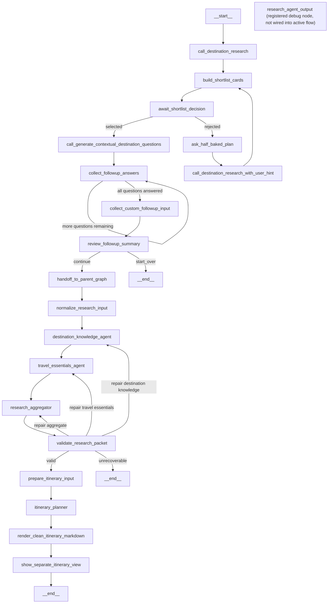

# Travel Agent

An India-focused travel planning application built with LangGraph, FastAPI, Streamlit, and OpenAI models.

The app collects a traveler's trip inputs, generates a destination shortlist, asks destination-aware follow-up questions, runs grounded research, validates the research packet, and produces a structured final itinerary with markdown and JSON artifacts.

This project is a controlled planning workflow, not a single free-form chatbot prompt.

---

## Project Overview

The system is split into staged planning steps:

1. Destination shortlisting
   - Generates exactly 4 India destination cards.
   - Uses a dedicated information-curator flow.
   - Lets the user reject and refine the shortlist with a custom hint.

2. Destination-specific follow-up questions
   - Asks 4 to 6 follow-up questions after a destination is selected.
   - Supports `single_select`, `multi_select`, and `text` answers.
   - Allows an optional custom note before final confirmation.

3. Grounded research
   - Normalizes the selected destination, trip profile, preferences, and constraints.
   - Runs separate destination knowledge and travel essentials research nodes.
   - Aggregates citations, warnings, and compact planning facts.

4. Research validation and repair
   - Checks that the research packet has destination overview, place clusters, movement guidance, practical essentials, and citations.
   - Runs one compact repair pass for the missing research target when possible.

5. Itinerary planning and rendering
   - Builds one recommended route, not multiple competing options.
   - Produces a structured itinerary with day-by-day planning, costs, essentials, and sources.
   - Renders a clean markdown itinerary for the UI and API.

6. Artifact output
   - Writes snapshots, final markdown, structured JSON, and workflow graph files under `output/`.
   - Supports both API-driven runs and Streamlit-driven runs.

---

## Architecture Diagram

The active LangGraph workflow is defined in `main.py`.



### Architecture Summary

- LangGraph orchestrates the workflow and interruption/resume logic.
- FastAPI exposes the planning flow as a programmatic API.
- Streamlit provides the interactive chat-style UI and final itinerary view.
- OpenAI models are used for shortlisting, research, and itinerary synthesis.
- Artifacts are written to local disk for review and debugging.

---

## Repository Structure

```text
.
|-- api.py                       # FastAPI endpoints and in-memory plan lifecycle
|-- app.py                       # Streamlit launcher
|-- llm.py                       # Model configuration and OpenAI tool binding helpers
|-- main.py                      # LangGraph definition and compilation
|-- requirements.txt             # Python dependencies
|-- run_apps.ps1                 # Windows/PowerShell startup helper
|-- .env.example                 # Environment variable template
|-- constants/
|   |-- india_locations.json     # State/city source used by the Streamlit UI
|   `-- prompts/                 # Prompt definitions for curator, research, and itinerary stages
|-- nodes/                       # LangGraph node implementations and routing
|-- schemas/                     # Typed graph state definitions
|-- services/                    # Parsing, artifacts, research helpers, and Streamlit artifact support
|-- tests/                       # API, graph, validation, and UI-state tests
`-- UI/                          # Streamlit UI components, session state, and itinerary view
```

---

## Tech Stack

Dependencies are pinned in `requirements.txt`.

- Python
- FastAPI
- Uvicorn
- Streamlit
- LangGraph
- LangChain Core
- LangChain OpenAI
- Pydantic
- python-dotenv
- pytest
- httpx

The default model is configured in `llm.py`:

```text
gpt-5.4-mini
```

Set `OPENAI_MODEL` to override the model for all phases.

---

## Environment Setup

### 1. Create a virtual environment

```bash
python -m venv .venv
```

Activate it:

```powershell
.\.venv\Scripts\Activate.ps1
```

On macOS or Linux:

```bash
source .venv/bin/activate
```

### 2. Install dependencies

```bash
pip install -r requirements.txt
```

### 3. Configure environment variables

Create `.env` from `.env.example`:

```env
OPENAI_API_KEY=your_openai_api_key_here
OPENAI_MODEL=gpt-5.4-mini
```

Required:

- `OPENAI_API_KEY`

Optional:

- `OPENAI_MODEL`, defaulting to `gpt-5.4-mini`
- `TRAVEL_RESEARCH_CACHE_DIR`, defaulting to `.travel_research_cache`

---

## Run the Application

### Streamlit only

```bash
streamlit run app.py
```

### FastAPI only

```bash
uvicorn api:app --reload --port 8000
```

FastAPI docs are available at:

```text
http://127.0.0.1:8000/docs
```

### FastAPI and Streamlit together

```powershell
.\run_apps.ps1
```

This starts FastAPI on port `8000`, starts Streamlit on port `8501`, and opens the Streamlit UI.

To stop existing owners of those ports and restart both apps:

```powershell
.\run_apps.ps1 -Restart
```

The script currently runs both services through a Conda environment named `compute`:

```powershell
conda run -n compute uvicorn api:app --reload --port 8000
conda run -n compute streamlit run app.py --server.port 8501 --server.headless true
```

Create that environment or edit the script if your local environment uses a different name.

---

## How the Application Works

### Streamlit Flow

The Streamlit UI collects:

- origin state and city or district
- trip date range
- trip type: `solo`, `couple`, `family`, or `group`
- member count when needed
- whether kids or seniors are included
- budget mode: `standard`, `premium`, `luxury`, or `custom`
- custom budget value when selected

After basic input collection, Streamlit invokes the LangGraph workflow. The graph can pause for:

- shortlist selection
- rejected shortlist custom hint
- follow-up question answers
- optional custom follow-up note
- final follow-up summary confirmation

When the itinerary is ready, the UI can switch from chat flow to itinerary view and show the structured itinerary and validation payload.

### API Flow

The API supports a review-based lifecycle:

1. Create a plan.
2. Read the current plan state.
3. Resume graph interruptions with review input.
4. Fetch the final itinerary after completion.

API state is currently stored in the in-memory `PLANS` dictionary, while output artifacts are written to disk.

---

## API Endpoints

### `POST /plan`

Creates a new plan and starts the graph.

Example request:

```json
{
  "origin": "Bangalore, Karnataka",
  "start_date": "2026-06-01",
  "end_date": "2026-06-05",
  "trip_type": "family",
  "member_count": 4,
  "has_kids": false,
  "has_seniors": true,
  "budget_mode": "premium",
  "budget_value": null
}
```

### `GET /plan/{plan_id}`

Returns the current plan status, stage, draft payload, required action, artifact paths, and error if present.

### `POST /plan/{plan_id}/review`

Resumes a plan when the graph is waiting for human input.

Supported review actions are:

- `approve`
- `reject`
- `modify`

Depending on the current interrupt, the request can include:

- `selected_index`
- `answer`
- `feedback`

### `GET /plan/{plan_id}/final`

Returns the final markdown itinerary, structured itinerary JSON, and artifact paths after the plan is complete.

---

## Output Artifacts

All planning artifacts are written under:

```text
output/
```

API-driven runs write to:

```text
output/<plan_id>/
```

Streamlit-driven runs write to:

```text
output/streamlit-<thread_id>/
```

Typical files:

```text
metadata.json
status.json
draft.json
graph_state.json
interrupt.json
final.md
final_itinerary.json
workflow_graph.mmd
workflow_graph.png
```

Notes:

- `interrupt.json` exists only while a run is waiting for review.
- `final.md` and `final_itinerary.json` are written after final itinerary completion.
- `workflow_graph.png` depends on Mermaid PNG rendering support. The code keeps the Mermaid file even if PNG rendering fails.

---

## Research Cache

Research nodes use a simple file-based cache.

Default cache directory:

```text
.travel_research_cache/
```

Current TTLs:

- `destination_knowledge`: 7 days
- `travel_essentials`: 1 day

Set `TRAVEL_RESEARCH_CACHE_DIR` to use a different cache location.

---

## Testing

Run the test suite with:

```bash
pytest -q
```

The tests cover:

- API contract behavior
- shortlist card normalization
- curator web-search configuration
- follow-up question flow
- final confirmation flow
- research input normalization
- research and itinerary validation contracts
- Streamlit artifact writing
- session-state helpers
- shared model configuration

---

## Known Limitations

- Graph checkpointing uses `InMemorySaver`, so graph state is not durable across process restarts.
- API plan storage uses an in-process `PLANS` dictionary and is not multi-worker safe.
- The app is India-focused by design; prompts and location data are tailored to India travel.
- There is no database-backed user, session, or job model.
- The PowerShell startup script assumes a Conda environment named `compute`.
- Mermaid PNG rendering may fail depending on the local environment.
- The current UI does not include destination imagery.
- Final output is markdown and JSON; there is no default branded PDF or document export.
- `research_agent_output` is registered as a debug node but is not wired into the active execution path.

---

## Future Improvements

- Replace in-memory graph checkpointing with durable checkpoint storage.
- Replace the in-memory API plan store with a database.
- Add authentication and authorization before exposing the API publicly.
- Add structured logging, tracing, and cost monitoring.
- Add retry and backoff around model and tool failures.
- Improve refresh/reconnect behavior in the Streamlit flow.
- Run independent research stages in parallel where appropriate.
- Add richer itinerary visualization in the UI.
- Add polished document export such as PDF or DOCX.
- Store artifact metadata in a database while keeping large files on disk or object storage.
