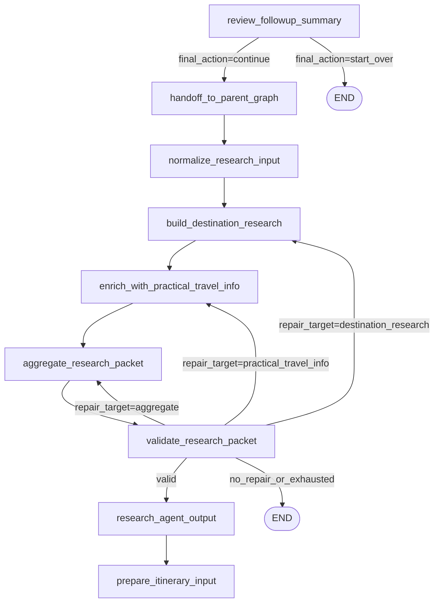

# Research Agent (Detailed Guide)

## What This Agent Does

The Research Agent is the **second major workflow** in your LangGraph pipeline.

Its job is:

1. Receive finalized intent from Information Curator.
2. Convert that handoff into compact research input.
3. Run destination intelligence research.
4. Enrich with practical travel facts.
5. Aggregate all research into one compact packet with citations.
6. Validate packet quality/size and do one targeted repair pass if needed.
7. Emit a debug-friendly research output and hand off to itinerary planning.

It is a factual, citation-backed layer between user intent curation and itinerary generation.

## Transition From Information Curator -> Research Agent

This transition is controlled in `main.py` + `nodes/routing.py` + `nodes/handoff_to_parent_graph.py`.

### 1) Final decision gate

- Node: `review_followup_summary`
- Router: `route_final_action(state)`
- Rule:
  - if `final_action == "continue"` -> route to `handoff_to_parent_graph`
  - if `final_action == "start_over"` -> route to `END`

### 2) Handoff marker

- Node: `handoff_to_parent_graph(state)`
- Behavior:
  - copies state
  - sets `information_curator_complete = True`
  - returns updated state

### 3) Research flow starts

- Edge: `handoff_to_parent_graph -> normalize_research_input`
- This is the first Research Agent node.

### 4) What information is passed

`normalize_research_input` reads curated fields from `TravelState`, mainly:

- `selected_destination`
- `followup_answers`
- `followup_custom_note`
- `followup_change_request`
- trip basics: `origin`, `start_date`, `end_date`, `trip_days`, `trip_type`
- budget/group signals: `budget_mode`, `budget_value`, `member_count`, `has_kids`, `has_seniors`

Then it builds `research_input`:

- destination summary fields (`destination`, `selected_destination`)
- trip/group summary (`trip`, `group_signals`)
- inferred behavior fields (`interests`, `pace`, `constraints`)
- preference payload (`preferences`)
- deterministic curator text (`curator_summary`, alias `final_brief`)

## Where The Code Lives

### Graph wiring (nodes + edges)

- `main.py`
  - `build_graph()`
  - Research nodes and edges are defined here.

### Routing logic

- `nodes/routing.py`
  - `route_research_validation()`
  - Handles one compact repair cycle and success routing.

### Research agent nodes

- `nodes/handoff_to_parent_graph.py`
- `nodes/research_agent.py`
  - `normalize_research_input()`
  - `build_destination_research()`
  - `enrich_with_practical_travel_info()`
  - `aggregate_research_packet()`
  - `validate_research_packet()`
  - `research_agent_output()`

### Prompt contracts

- `constants/prompts/research_agent_prompts.py`
  - Destination research JSON contract prompt
  - Practical enrichment JSON contract prompt

### Model/tool runtime setup

- `llm.py`
  - `get_research_llm()`
  - Uses Responses API compatible GPT-5 research model.

### Parsing + cache helpers

- `services/llm_response_parsing.py`
  - Parses model output into JSON safely.
- `nodes/research_cache.py`
  - Stable cache key + TTL-based payload cache.

### Shared state contract

- `schemas/travel_state.py`
  - Defines all research-related `TravelState` keys.

### UI observability (status shown to user)

- `UI/app.py`
  - Shows `"information_curator_complete"` state.
  - Shows research validation issues and research packet preview.

## Research Tools, Notes, and Runtime Behavior

### Tools used by the research nodes

Inside `nodes/research_agent.py`:

- `RESEARCH_TOOLS = [{"type": "web_search"}]`
- Bound through model call:
  - `get_research_llm().bind_tools(RESEARCH_TOOLS, tool_choice="auto", reasoning={"effort": "medium"})`

This means destination/practical nodes can use server-side web search for live facts.

### Notes and compactness controls

- Packet size budget:
  - `RESEARCH_PACKET_CHAR_BUDGET = 16000`
- Automatic compaction:
  - `_compact_research_packet(...)` trims text/list sizes progressively.
- Citation normalization:
  - merges, deduplicates, and limits citations.
- Validation + repair:
  - `validate_research_packet()` sets `repair_target`
  - `route_research_validation()` routes to one retry target
  - each repair target is capped to one retry attempt

### Cache behavior

- Key generation:
  - `make_cache_key(node_type, payload)` with SHA-256 hash of compact JSON input
- Read/write:
  - `get_cached_payload(...)`
  - `set_cached_payload(...)`
- TTL depends on node type (`nodes/research_cache.py`)

## Research State Fields

Key `TravelState` fields used/produced by Research Agent:

- Input from curator:
  - `selected_destination`
  - `followup_answers`
  - `followup_custom_note`
  - `followup_change_request`
  - trip/group/budget signals
- Handoff marker:
  - `information_curator_complete`
- Research outputs:
  - `research_input`
  - `destination_research`
  - `practical_travel_info`
  - `research_packet`
  - `research_validation`
  - `research_agent_output`
  - `citations`
  - `research_warnings`

## Step-by-Step Node Behavior

### 1) `normalize_research_input`

- Validates that `selected_destination` exists.
- Cleans follow-up answers and optional notes.
- Builds deterministic `curator_summary`.
- Infers:
  - `interests`
  - `pace` (`relaxed` / `balanced` / `active`)
  - explicit constraints
- Writes `research_input`.

### 2) `build_destination_research`

- Uses destination prompt contract + `research_input`.
- Model may use `web_search`.
- Parses JSON response and normalizes fields:
  - summary, clusters, must-do/optional places, activities, constraints, warnings, assumptions, citations
- Writes `destination_research`.

### 3) `enrich_with_practical_travel_info`

- Uses practical prompt contract.
- Inputs:
  - projected `research_input`
  - projected `destination_research`
- Produces practical sections:
  - weather, carry, local transport, money, documents, safety, connectivity, culture, warnings, citations
- Writes `practical_travel_info`.

### 4) `aggregate_research_packet`

- Merges destination + practical outputs.
- Builds unified `research_packet` with compact practical notes structure.
- Merges/deduplicates citations and warnings.
- Applies size compaction under budget.
- Writes:
  - `research_packet`
  - `citations`
  - `research_warnings`

### 5) `validate_research_packet`

- Checks required readiness:
  - summary, duration fit, area coverage, must-do places, optional key presence, practical notes, citations, size budget
- Builds `research_validation`:
  - `valid`
  - `issues`
  - `repair_target`
  - `repair_attempts`

### 6) `route_research_validation` (conditional route)

- If valid -> `research_agent_output`
- Else one retry route:
  - `destination_research` issue -> `build_destination_research`
  - practical issue -> `enrich_with_practical_travel_info`
  - aggregate/size issue -> `aggregate_research_packet`
- If retry exhausted/unresolvable -> `END`

### 7) `research_agent_output`

- Requires `research_validation.valid == True`.
- Requires `research_packet` dict.
- Emits compact debug summary:
  - destination summary
  - duration fit
  - must-do/optional counts
  - practical topic keys
  - citation count
- Then graph continues to itinerary node:
  - `prepare_itinerary_input`

## Exact Edge Connectivity (Research Scope)

Defined in `main.py`:

- `handoff_to_parent_graph -> normalize_research_input`
- `normalize_research_input -> build_destination_research`
- `build_destination_research -> enrich_with_practical_travel_info`
- `enrich_with_practical_travel_info -> aggregate_research_packet`
- `aggregate_research_packet -> validate_research_packet`

Conditional (`route_research_validation`):

- `validate_research_packet -> research_agent_output` when valid
- `validate_research_packet -> build_destination_research` for destination repair
- `validate_research_packet -> enrich_with_practical_travel_info` for practical repair
- `validate_research_packet -> aggregate_research_packet` for aggregate/size repair
- `validate_research_packet -> END` when no valid repair route remains

Research to itinerary handoff:

- `research_agent_output -> prepare_itinerary_input`

## Mermaid Diagram

## Prompt and Output Contracts (Quick View)

Destination node contract (`DESTINATION_RESEARCH_*`):

- compact destination summary and duration fit
- place buckets: must-do, optional, niche
- experiences/food/activities
- constraints/warnings/assumptions
- citations

Practical node contract (`PRACTICAL_TRAVEL_INFO_*`):

- weather summary/facts/warnings
- carry + on-ground practicals
- local transport, money, documents
- safety, connectivity, culture
- warnings + citations

Both contracts enforce JSON-only output.

## Practical Debug Notes

- If research does not start after curator:
  - verify `final_action == "continue"` and transition through `handoff_to_parent_graph`.
- If it loops in validation:
  - inspect `research_validation.repair_target` and `repair_attempts`.
- If itinerary did not start:
  - check whether `research_validation.valid` is true.
- If output is too large:
  - inspect packet compaction and citation volume in `research_packet`.
- If facts look stale:
  - inspect cache input shape and TTL behavior in `nodes/research_cache.py`.

## One-Line Summary

The Research Agent converts curated intent into a compact, validated, citation-backed research packet (with one-pass repair logic) and hands it cleanly to itinerary planning.
